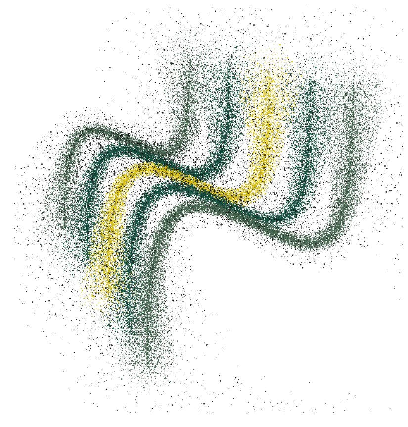
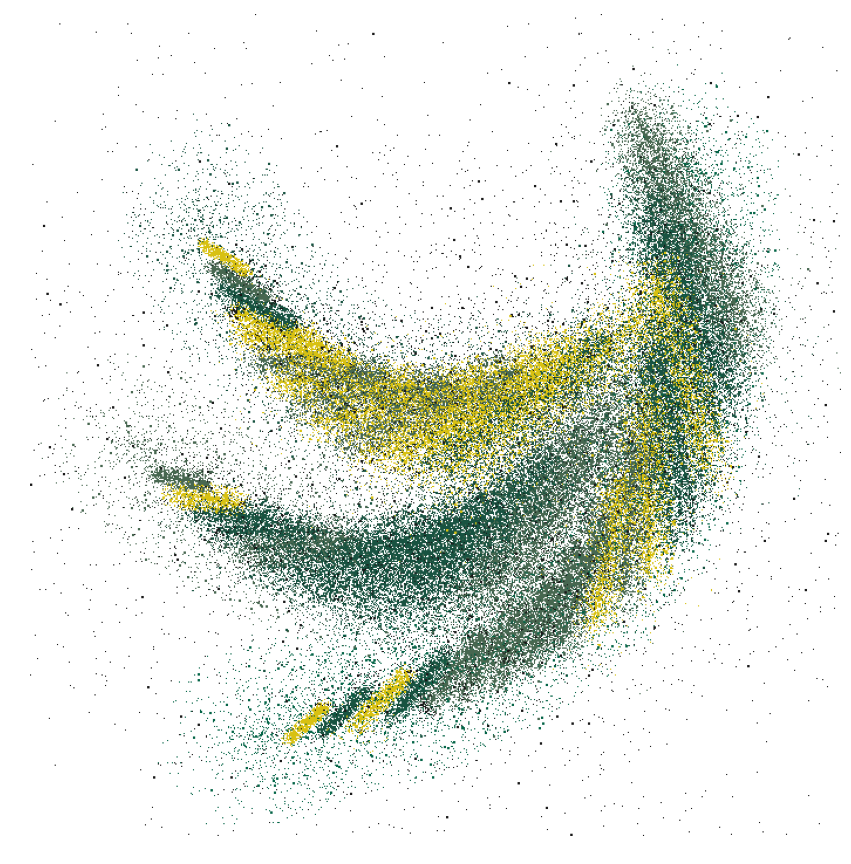

# Pattern prediction - Granule Deposition

This package complements the publication:
Beyond Transparency: Architectural Application of Robotically Fabricated Polychromatic Float Glass (2022).

The code presented here implements the following part of the paper: Section 2.4.1, Pattern prediction

## Instructions
The code that creates the pattern prediction is in the file 'Pattern_prediction.ipynb'. 
This takes as input a json file (saved in the 'input' folder), and outputs an image and a video (saved in the 'output' folder), according to the 
selection of parameters on top of the .ipynb file. 

### Installations
To run the code you need to install the following libraries:
- nupy : https://numpy.org/install/
- matplotlib : https://anaconda.org/conda-forge/matplotlib

If you want to render a video you need additionally
- ffmeg : https://anaconda.org/conda-forge/ffmpeg

### Creation of input json file
You can create the json file that is required as an input, using the 'create_pattern_input.gh'. Upon opening the file, you can 
see two examples for how to do that; the pattern_1.json and pattern_2.json have been generated as samples using this file. 

